## Google Meet 分組擴充功能 by 胡浩洋

## 線上的說明書

<!-- omit in toc -->

## [詳細操作說明影片](https://youtu.be/W_XZYIf0fFI)

### 設定

- 第一步: [輸入課程](#第一步輸入課程)
- 第二步: [創建討論室](#第二步創建討論室)
- 第三步: [調整設定](#第三步調整設定)
- 第四步: [調整 Meet 變更版面配置](#第四步-調整-meet-變更版面配置)
- 第五步: [確認 Google 帳號](#第五步-確認-google-帳號)

### 教書

- 第一步: [選課與指定幾個分組](#第一步選課與指定幾個分組)
- 第二步: [開課](#第二步開課)
- 步驟 3A: [分組學生-臨時](#步驟-3a-分組學生-臨時)
- 步驟 3B: [分組學生-預先](#步驟-3b-分組學生-預先)
- 第四步: [滑桿控制，入出分組與操作視聽設備](#第四步滑桿控制入出分組與操作視聽設備)
- 第五步: [廣播系統](#第五步廣播系統)
- 第六步: [靜音和移除學生](#第六步靜音和移除學生)

### 工具

- [隱藏顯示 Meet 下面的面板](#隱藏顯示-meet-下面的面板)
- [重新視窗格式](#重新視窗格式)
- [縮小放大控制面板](#縮小放大控制面板)
- [簡報](#簡報)
- [導出入數據](#導出入數據)

### 常問問題

  <!-- omit in toc -->

- [學生需要安裝這個擴充功能?](#學生需要安裝這個擴充功能)
- [我的電腦需要多大的記憶體（RAM）?](#我的電腦需要多大的記憶體-ram)
- [為什麼在分組區域無法看任何的學生?](#為什麼在分組區域無法看任何的學生)
- [為什麼無法看所有的學生?](#為什麼無法看所有的學生)
- [Co-teachers 可以使用?](#co-teachers-可以使用)
- [學生需要退出大教室?](#學生需要退出大教室)
- [怎麼關閉討論室](#怎麼關閉討論室)
- [怎麼使用我的擴充功能資料在兩台電腦?](#怎麼使用我的擴充功能資料在兩台電腦)

### 第一步：輸入課程

- 這件擴充功能是由課程來組織的. 第一步驟是在「課程」標籤內輸入您的課程.

  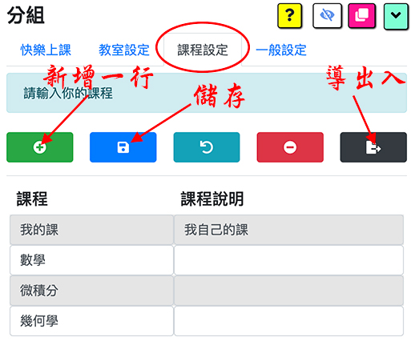

- 要輸入幾個課程？ 事實上，只需要輸入一個課程就可以，然後每門課再用這一個同樣課程。不過因為有些課之時間很密集，所以建議在擴充功能多輸入課程，免得兩堂課之間的學生有衝突。如果你認為比較整齊是給每一門課自己的擴充功能課程名稱，就可以。看你的方便。
- 調整教室的順序：拉一行往上下，請長按一行，然後給那行拉往上下
- 改一行文字的全部，請在文字框按三次（click 3 times)，然後這行文字全部會突出顯示。
- 新增一行：請按綠色的「+」按鈕
- 儲存資料：請按藍色的按鈕。
- 課程獨特名稱：每一間討論室必要獨特的名稱，不能重覆
- 課程刪掉：刪除一行是從行列的從最後面開始，若想把中間的行給刪掉，請拉下到最下面然後按紅色的按鈕就給最下面行刪掉
- 課程導出入是擴充功能資料的全部：導出入數據的按鈕是在最右邊黑色的按鈕。資料導出是為了個自己一個 backup，或許如果你有兩台電腦，能從第一胎電腦下載然後裝上去第二胎。**_小心_**：導入會重寫擴充功能資料的全部。

### 第二步：創建討論室

- 在討論時標籤內能創建討論室

  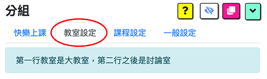

- :smile: **_最簡單的方法是給連結框框留著空白，不輸入任何的東西，然後儲存._** 這樣擴充功能會自動給你連結，這麼簡單.

  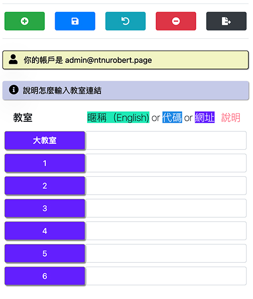

- **_Google Classroom 老師_**: 如果你是 Google Classroom 老師，在「大教室」連結框，請輸入你的 Google Classroom “Meet Link".

  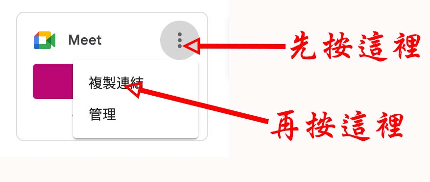

  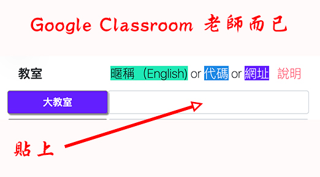

- 連結的種類:

  - _暱稱（Nickname）_: 暱稱是動態的，因為每次使用 url 會創建新的連結。 暱稱是給付費 google 會員使用的，所以免費的使用者應該不會有這個功能。請注意暱稱需要獨特的名稱，免得兩位老師好一起用相同名字發生遇到同樣的 meet 連結裡面。

  - _代碼（Code）_: 代碼是連結的尾 12 字，比方說 https://meet.google.com/abc-defg-hij 的連結， 代碼是 abc-defg-hij. 這樣能輸入「abc-defg-hij」就可以。這個方法是不常用的。

  - _Meet 連結（Meet Url）_: 這是最常用的方法，留著空白就儲存，擴充功能會給你新的連結。如果你想全新的連結，就刪除留著空白儲存，擴充功能會給你新鮮的連結。

  - _普通連結（Resource Url）_: 任何的連結，比方說 youtube, 網站，等等.

### 第三步：調整設定

- 獨立視窗 / 視窗內的標籤: 挑選你想要的格式，獨立視窗或視窗的標籤。若選標籤的話，能制定在視窗頂多的標籤

  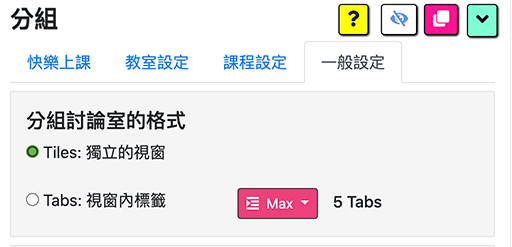

- 顏色: 挑選 meet 的下面工具欄有什麼顏色

- 讓外人自動進入：建議不要勾選，不然持著你教書連結的外人能夠自動闖入。不過如果你不擔心這個情況，就可以勾選。由你來決定，基本上建議不優勾選。

- 美好控制板的環境：在滑桿控制背景畫面與廣播背景畫面，可以選網路上的照片，換顏色，等等。

- 自動加入 meet. 首先，擴充功能只管理自己在「教室設定」標籤內輸入的連結，擴充功能不管「教室設定」外的 meet 連結。如果擴充功能看到在電腦有一個它要管理的連結，擴充功能會幫你按「立即加入」按鈕。如果你不想要自動加入，就可以把勾選給空白，不打勾。

- 不常用的方法，建議不要勾選：如果每次上課需要新的連結，就勾選大教室或討論室。在「快樂上課」標籤，「開始上課」區域內，按開啟大教室或討論室的按鈕時，擴充功能會自動給你新增的連結，並在「教室設定」標籤內輸入創新的連結。如果勾選「討論室」比較沒問題因為開課前沒有必要通知學生討論室的連結，但勾選「大教室」比較麻煩因為要開課前需要通知學生大教室的連結，不過若勾選「大教室」要先開啟大教室才知道這個大教室的連結是什麼。建議：如果不需要這個功能，請兩個都不給勾選，留著空白。

### 第四步: 調整 Meet 變更版面配置

-為了讓擴充功能看到你大教室所有學生，有一個 meet 設定，設定一次就可以，不用再管理它。

- 在截圖看到三個點按鈕，按一下，會有彈簧菜單出現，按「變更版面配置」。

  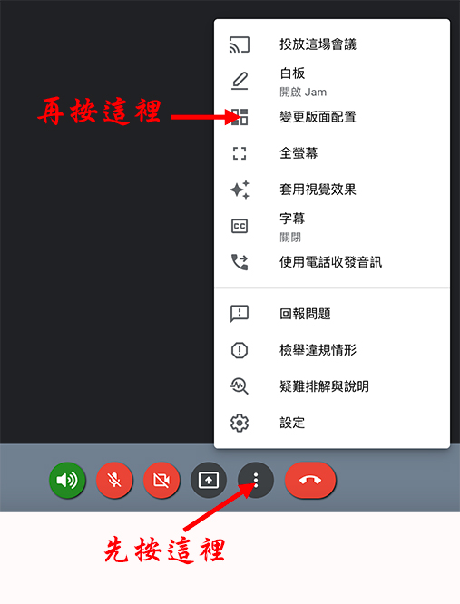

- 按「圖塊」，然後把「排顯示」的滑桿拉到最右邊的 49。

  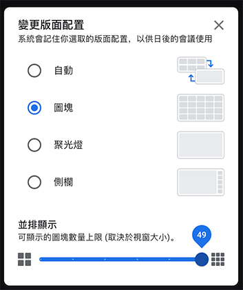

### 第五步: 確認 Google 帳號

- 確認一下，顯示的帳號是你教書的 google 帳號，如果不是，請給它按一下。

  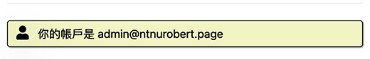

- Google meet 注意創新連結是從什麼帳號來的做，這樣 Google 認為該帳號是連結的主人。 如果你用了一個帳號創新連結，但換了帳號使用開啟的，Google 可能拒絕因為 Google 認為你並不是該連結的主人。

- 什麼是「主人」的帳號？ 是在你的電腦，**第一** 登入的 google 帳號。之後你能登入無限的帳號沒關係，主人的帳號還是你第一登入的 google 帳號。

- 如果發現「主人」帳號是錯，很簡單。按下面的藍色按鈕，全部登出，重新登入，注意第一個登入是你想要的主人帳號。

  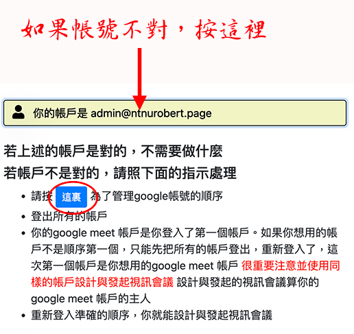

### 第一步：選課與指定幾個分組

- 在「快樂上課」標籤，按「開始上課」就會出現：

  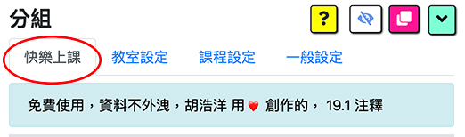

- 在「課程」按鈕選你的課程，在幾個分組選你想要多少討論室。如果妳打開討論室後，決定要躲開討論室沒關係，就可以躲開，然後請按[重新視窗格式](#重新視窗格式) 整理好在螢幕上的試穿。

  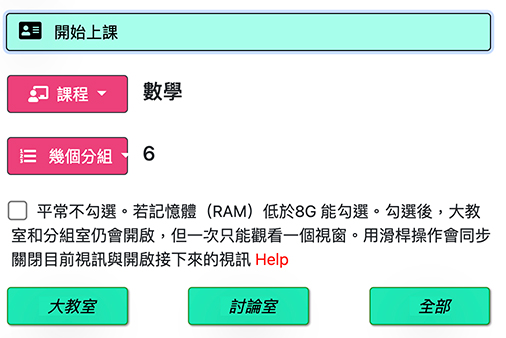

### 第二步：開課

- 在「開始上課」區域有三個按鈕

  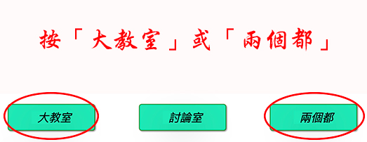

- 你可以按「大教室」打開只有大教室，或按「全部」打開大教室與討論室都有。
- 如果先按「大教室」單打開大教室，你能後來按「討論室」打開討論室。如果大教室已經開了，你按了「全部」按鈕請放心，大教室不會被打開了第二次。

- Google Classroom 老師而已:

  - 如果你先在擴充功能開啟「大教室」，再過去你的 Google Classroom 主頁開那邊的 meet 連結，你就已經是跟擴充功能同步（synced up).
  - 不過大部分 Google Classroom 老師會先在 Google Classroom 主頁開 meet 連結. 這樣的話，你開擴充功能的大教室就能把擴充功能與 Google Classroom meet 連結同步（synced up).
  - 小提醒 Google Classroom 老師，請把你的 Google Classroom meet 連結複，在「教室設定」大教室連結框貼上去 [創建討論室](#第二步創建討論室)

- 上課時，你能隨時多加討論室開啟，開啟後
- :warning: 除非你的電腦記憶體非常的小（像 chromebook 4GB 一樣）請不要給低記憶體（RAM）的勾選打勾。這是專門給小記憶體電腦用的，雖讓能夠開所有的視窗，但因為那種小台電腦記憶體不夠大，所以只能同時開一個視窗。
- :star: 為了整理 meet 視窗，讓畫面比較整齊，請按「重新視窗格式」按鈕

  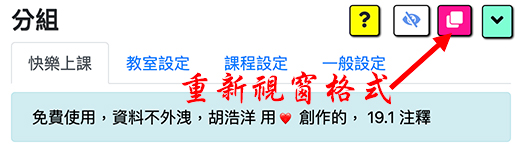

### 步驟 3A： 分組學生-臨時

- 為了臨時分組，請按下面的按鈕:

  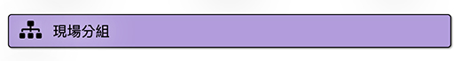

- 請確認在你的大教室螢幕能夠看所有的學生，在圖塊的格式 [變更版面配置](#第四步-調整-meet-變更版面配置).

  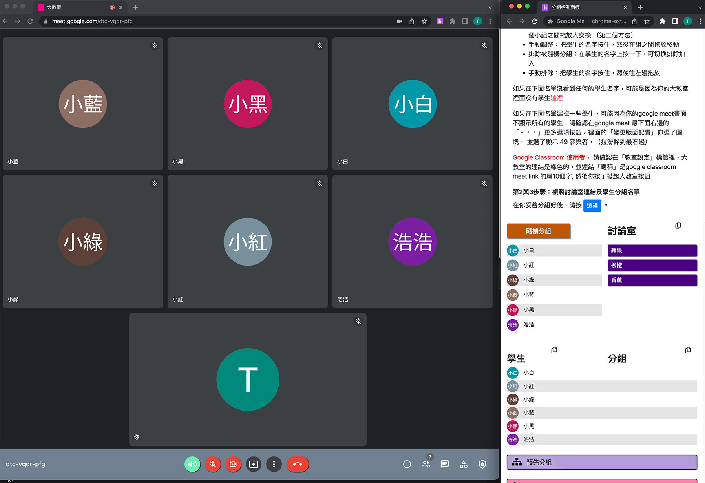

- Now you may click on the Randomly Assign button to shuffle the students among the groups. You may click the Random button as many times as you wish until you see a reasonable grouping. Also, you may drag and drop students between groups.

  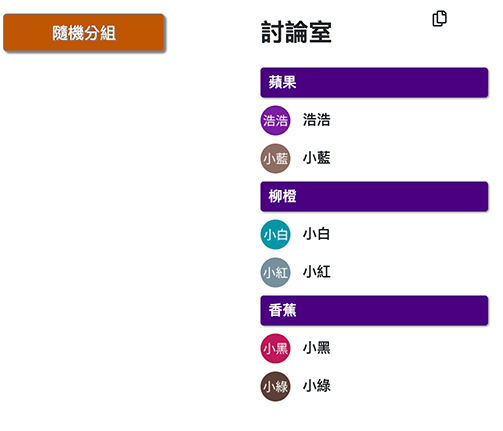

- Next please click on the button below which will create a popup window.

  

- In this popup window below, click on the first button to copy the Breakout Room Links and then please go to the Main room chat window and paste them in the chat box.
- Click on the second button to copy the Breakout Rooms Assigned Students list and paste them in the chat box.

  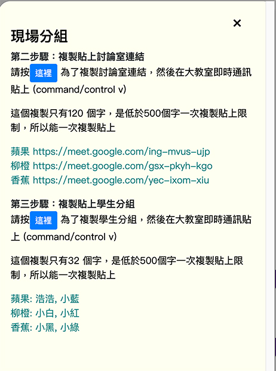

- Paste the two lists (Breakout Rooms Links, and Breakout Rooms Assigned Students) into the chat window below. Google Meet has a 500 character limit on each paste so if the list is long then you may need to divide it up and paste in a couple of chunks.

  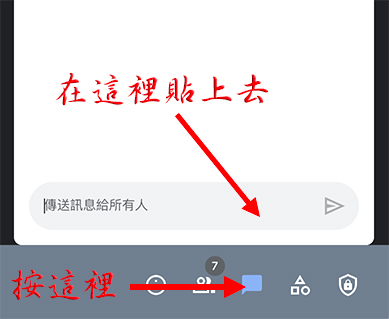

- In this example, my rooms are 1, 2, and 3 so that is why the listing shows 1, 2, 3. If I had room names such as "Apple, Orange, and Banana" then the rooms listings would reflect these names, "Apple: ..., Orange: ..., Banana: ..."

- If you have not already done so, please remember to open the breakout rooms by clicking on the "Breakouts" button below. You may open the breakout rooms early, prior to assignment of students, if you want to.

  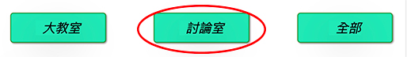

### 步驟 3B： 分組學生-預先

- 預先的指示在擴充功能寫上的，這個過程跟臨時分組是差不多，
- 差別是老師會事先自己在另外電子檔（ms word, 任何 text app) 寫下來討論分組，然後把這個檔案文字複製，轉移到大教室的 meet 通話中的訊息下面框貼上去，傳送訊息給所有的學生。

  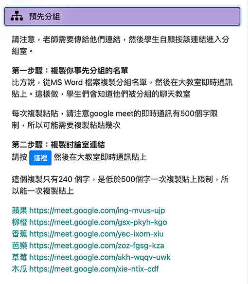

### 第四步：滑桿控制，入出分組與操作視聽設備

- 滑桿控制（slider) 會讓老師入出討論室，在滑桿控制給左右箭頭按一下，或給小黃點移動。

  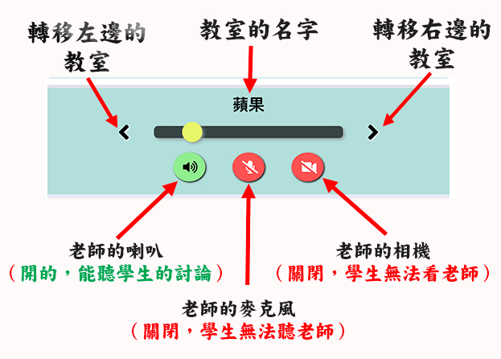

- 滑桿控制（slider) 也會讓老師操作自己的喇叭，自己的麥克風，自己的相機如下：

  - 在這個討論室:
    - 開喇叭，這樣老師能夠聽學生的討論
    - 關閉老師的麥克風所以不會打擾學生的討論。如果老師想講話，請在 slider 按麥克風。再按一次會關閉。
    - 關閉老師的相機所以不會打擾學生的討論。如果老師想開相機，請在 slider 按麥克風。再按一次會關閉。
  - 在所有其它教室:
    - 喇叭關閉.
    - 麥克風關閉
    - 相機關閉

- 建議老師都用滑桿控制 （slider) 操作視聽的按鈕。如果老師在 meet 直接按 meet 的視聽按鈕（喇叭，麥克風，相機）meet 與控制面板會造成不一致，但這個是小問題。下次老師給 slider 移動，meet 與 slider 的視聽按鈕就會行程一致。

### 第五步：廣播系統

- 廣播系統有三個按鈕：老師的喇叭，老師的麥克風，老師的相機。

  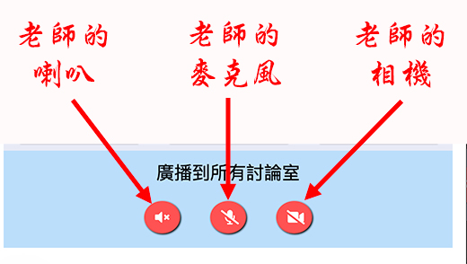

- 退出廣播系統有兩個方法。如果你在滑桿控制移動，按左右或給小黃點移動，廣播系統會自動關閉。或許能直接在廣播按鈕按一下，關閉

### 第六步：靜音和移除學生

- 給教室靜音有很多種選擇：大教室，這個討論室，所有討論室，所有的教室
- 給教室內的學生移除有多種選擇：這個討論室，所有討論室，大教室

  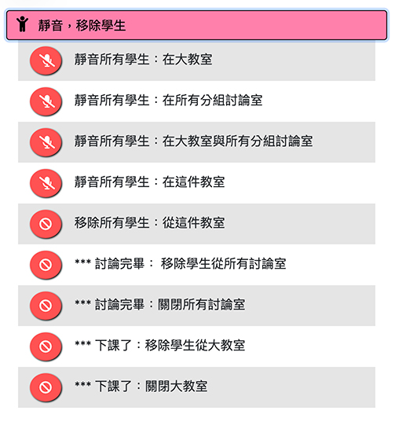

### 隱藏顯示 Meet 下面的面板

- 為了給自己多一點的 meet 空間，能使用這個按鈕。

- 按一次會把 meet 的最下面工具面板隱藏，再按一次會出現。

  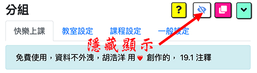

### 重新視窗格式

- 非常方便的按鈕會在螢幕上把所有的 meet 視窗重新整理好，看起來很整齊

  

### 縮小放大控制面板

- 按一次會縮小，再按一次會放大

  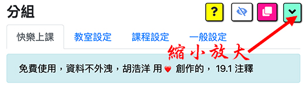

### 簡報

- 擴充功能有一些簡單的報告，能下載 csv 格式

  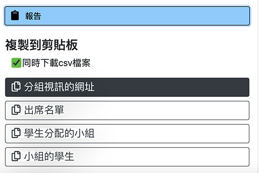

### 導出入數據

- 在「教室設定」與「課程設定」標籤內都有導出入黑色按鈕。

- **最常用的是「課程設定」標籤的**

  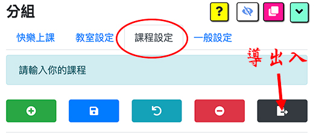

- 導出入文字檔非常的小，彈簧的視窗會問你要給它什麼名稱？下載是在你電腦的下載夾

- 如果是導入，輸入你的檔案名稱。

- **小心** 導入會重新寫在擴充功能所有的資料。

  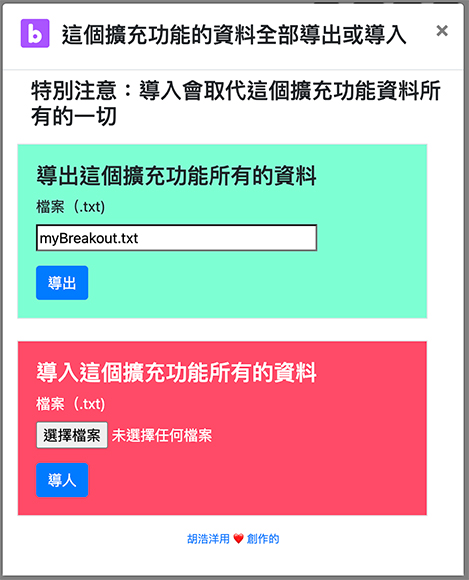

### 學生需要安裝這個擴充功能?

- 不需要，並且不建議他們安裝，因為對學生來說沒有用，有可能讓他們困惑，所有老師們請不要求學生安裝
- 若學生不小心安裝這個擴充功能沒關係，不影響老師操作。

### 我的電腦需要多大的記憶體 RAM?

- 如果你的電腦記憶體是 16G，應該足夠大開 10 個討論室。大多數老師跟我說需要 16 Gig RAM （記憶體）, 才能順利開操作大約 10 個討論室。我有一個 MacBook 具有 16G, 開過 15 個討論室就可以，但電腦好像跑地點辛苦（電風扇開了）。我的 Imac 記憶體超過 24G, 16 個討論室是無費吹灰之力

- 如果你的電腦記憶體非常的小（像 chromebook 4GB 一樣）可以考慮看看使用低記憶體（RAM）的方式。在「快樂上課」標籤，「開始上課」區域，給第一記憶體勾選打勾。這樣能夠開超過 20 個視窗，但因為那種小台電腦記憶體不夠大，所以只能同時開一個視窗。

### 為什麼在分組區域無法看任何的學生?

- 有可能因為 meet 的變更版面配置還沒調整到圖塊，49 個學生的格式，[調整 Meet 變更版面配置](#第四步-調整-meet-變更版面配置)

- 如果你是 Google Classroom 老師的話，請確認在「教室設定」標籤的大教室連結是你的 Google Classroom 主頁上的 meet link.

### 為什麼無法看所有的學生?

- 有可能因為 meet 的變更版面配置還沒調整到圖塊，49 個學生的格式，[調整 Meet 變更版面配置](#第四步-調整-meet-變更版面配置)

### Co-teachers 可以使用?

- 可以啊。這裡是英文版的影片說明怎麼使用
  [co-teachers](https://youtu.be/6Z_b4aWHrvY)

### 學生需要退出大教室?

- 不需要。我教書時後讓學生在大教室留下來。這樣學生在兩個教室同時存在，大教室與他們的討論室。如果你讓學生在大教室留下來，請注意在大教室所有學生靜音自己，免得大教室的聲音打擾。

- 行動設備像 iphone, ipad 這樣， 不讓學生同時開多餘的 meet, 所以在這樣的情況下，學生必要退出大教室。

### 怎麼關閉討論室?

- 一個方法是用控制面板，在「靜音移除學生」區域內，按討論室完畢的按鈕。或在討論室的 meet 直接關閉。關閉前，請記得用廣播系統通知學生要回去大教室。

### 怎麼使用我的擴充功能資料在兩台電腦?

- 在「課程設定」標籤內，按最右邊黑色按鈕導出入資料。從第一台電腦導出，在第二台電腦導入，請注意導入會把那台電腦所資料重新寫 (overwrite)
