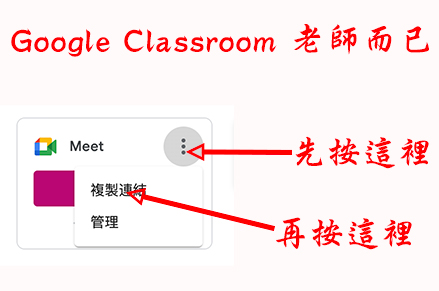
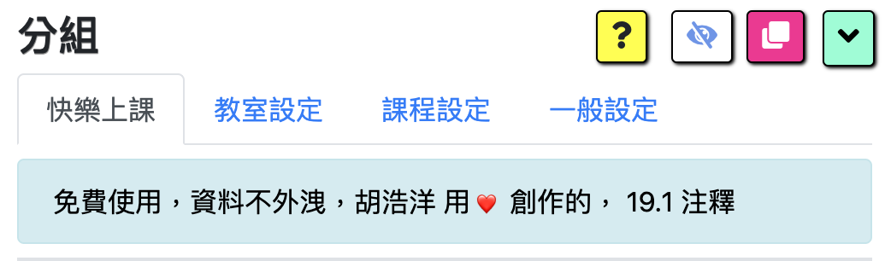

## Google Meet 分組擴充功能 by 胡浩洋

## 線上的說明書

<!-- omit in toc -->

## [一步一步的說明影片](https://youtu.be/W_XZYIf0fFI)

### 設計

- 第一步: [輸入課程](#第一步輸入課程)
- 第二步: [創建討論室](#第二步創建討論室)
- 第三步: [調整設計](#第三步調整設計)
- 第四步: [調整 Meet 變更版面配置](#第四步-調整-meet-變更版面配置)
- 第五步: [確認 Google 帳號](#第五步-確認-google-帳號)

### 上課

- 第一步: [選課與指定幾個分組](#第一步選課與指定個分組)
- 第二步: [開課](#第二步開課)
- 步驟 3A: [分組學生-臨時](#步驟-3a-分組學生-臨時)
- 步驟 3B: [分組學生-預先](#步驟-3b-分組學生-預先)
- 第四步: [入出分組與操作視聽設備](#第四步入出分組與操作視聽設備)
- 第五步: [廣播系統](#第五步廣播系統)
- 第六步: [靜音和移除學生](#第六步靜音和移除學生)

### 工具

- [隱藏顯示 Meet 下面的面板](#隱藏顯示-meet-下面的面板)
- [重新視窗格式](#重新視窗格式)
- [縮小放大控制板](#縮小放大控制板)
- [簡報](#簡報)
- [導出入數據](#導出入數據)

### 常問問題

  <!-- omit in toc -->

- [Do my students need to install this extension?](#do-my-students-need-to-install-this-extension)
- [How much memory (RAM) do I need to run the extension?](#how-much-memory-ram-do-i-need-to-run-the-extension)
- [What is a nickname, code, or URL?](#what-is-a-nickname-code-or-url)
- [Why is the extension not working properly?](#why-is-the-extension-not-working-properly)
- [Why can't I see any students in the Assign Participants section?](#why-cant-i-see-any-students-in-the-assign-participants-section)
- [Why can't I see all of my students?](#why-cant-i-see-all-of-my-students)
- [Does this extension work with co-teachers?](#does-this-extension-work-with-co-teachers)
- [Do students need to leave the main room?](#do-students-need-to-leave-the-main-room)
- [How can I close the breakouts?](#how-can-i-close-the-breakouts)
- [How can I simulate students to practice using the extension?](#how-can-i-simulate-students-to-practice-using-the-extension)
- [Do all the rooms have to be Meets?](#do-all-the-rooms-have-to-be-meets)
- [How can I use this extension on multiple computers?](#how-can-i-use-this-extension-on-multiple-computers)
- [Does this work with Google Classroom?](#does-this-work-with-google-classroom)
- [Will my extension data be overwritten with a new updated version?](#will-my-extension-data-be-overwritten-with-a-new-updated-version)

### 第一步：輸入課程

- 這件擴充功能是由課程組織的. 第一步驟是在「課程」標籤內輸入您的課程.

  

- 請注意：沒有必要在這裡輸入你所有的課程，有些老師只用幾個普通名字的像「課程 1，課程 2，課程 3」那樣，然後再用幾次這些課程。比方說，如果您的課程的前後時間不是很密集（不用擔心兩堂課之間的學生會有衝突），理論上可以輸入一個課程而已，然後一直再用這個課程。看你的方便來決定輸入幾個課程。

- 把一行網上下，請長按一行，然後整個行能往上下
- 如果想改一行內資料的全部，請按三次（click 3 times)，然後能刪掉的全部
- 新增一行，請按綠色的「+」按鈕
- 儲存資料，請按藍色的按鈕。
- 請注意：每一間討論室必要獨特的名稱，不能重覆
- 刪除一行是從行列的最後面開始，若想把中間的行給刪掉，請拉下最下面然後按紅色的按鈕給它刪掉
- 移入數據的按鈕是在最右邊黑色的按鈕。資料移除是為了個自己一個 backup，或許如果你有兩台電腦，能從第一胎電腦下載然後裝上去第二胎。

### 第二步：創建討論室

- 在討論時標籤內能創建討論室

  

- :smile: **最簡單的方法是給連結框框留著空白，不輸入任何的東西，然後儲存.** 這樣擴充功能會自動給你連結，這麼簡單.

  

- **Google Classroom 老師**: 如果你是 google class room 老師，你的擴充功能「大教室」討論室是你的 google classroom “Meet Link".

  **只有 google classroom 老師需要做這個:** 請從你的 google classroom 主頁複製 meet link， 然後在擴充功能的 Main room 貼上。

  

  

- 連結的種類:

  - _暱稱（Nickname）_: 暱稱是動態的，因為每次使用 url 會製造新的連結。 暱稱是給付費 google 會員使用的，所以免費的使用者應該不會有這個功能。請注意暱稱需要獨特的名稱，免得兩位老師好一起用相同名字發生遇到同樣的 meet 連結裡面。

  - _代碼（Code）_: 代碼是連結的未 12 字，比方說 https://meet.google.com/abc-defg-hij 的連結， 代碼是 abc-defg-hij. 這個方法是不常用的。

  - _Meet 連結（Meet Url）_: 這是最常用的方法，簡單的留著空白儲存，擴充功能就會給妳新的連結。不喜歡現在的連結？很賤的，就刪除留著空白儲存，給妳新的連結。

    不常用的方法：如果每次開課有新的連結，就能給下面的選項打勾。可以分別把新的連結給大教室或討論室。請記得如果選大教室的話又一點麻煩因為要先開大教室才知道新的連結是什麼告訴學生進入。除非你真的需要這個功能，建議不打勾。討論室給打勾的話比較沒有麻煩因為通常不是上課前告訴學生討論室的連結，而是臨時開討論室的給學生連結。

  - _普通連結（Resource Url）_: 任何的連結，比方說 youtube, 網站，等等.

### 第三步：調整設計

- Tabs/Tiles: This controls whether the breakout rooms each have their own window (tiles) or if they are separate tabs in a window (tabs). The tabs option can control the number of tabs within a window
  

- Colors: Customize the bottom border of your Google Meet

- Automatically Allow Outside Participants to enter: This allows participants from outside your organization to automatically enter your room without your approval. If you check this box then if the participant has the link then they can automatically enter the room. This is the equivalent of allowing yourself to be zoom bombed. It is a huge convenience to allow outside participants to enter breakout rooms if they have the link but there is the possibility that an unrecognized person who has this link may enter. The default is Off (not checked). Recommendation is to leave it off to prevent outsiders from entering without your approval.

- Slider and Broadcast Background Images: Choose an URL for an image or leave it blank and just choose a background color ("Back Color"). Font colors can be changed for light and dark background, as well as the position and size of the images

- Automatically Join Meet: Only meets whose URL is listed in the rooms tab may be eligible for an automatic join. For "eligible" meets, this automatic join function can be turned on or off by clicking or leaving the checkbox for the Main room and Breakout rooms. All meets with URLs that are not listed in the Rooms tab will not be automatically joined.

- Automatically refresh room links when opened: If the checkbox is selected then new room links will be created on-demand, whenever the Open button is clicked. This saves the teacher the steps of going to the Rooms tab, blanking out the rooms' links, and clicking save in order to get a fresh set of room links. Now the teacher can choose to have the rooms automatically generate brand new links when the Open room button is clicked.

- There is a checkbox for the Main room and the Breakout rooms, so each category is separately configureable. For example, if the teacher wants to keep the Main room link static but have the Breakout rooms links dynamically refreshed each time, then the teacher can deselect (not check) the Main room checkbox but check the Breakout rooms checkbox.

### 第四步: 調整 Meet 變更版面配置

- For the extension to work properly, you may need to change the setting on your google meet to 圖塊

- Click on the 3 dots button at the bottom on the google meet screen and choose "Change Layout"

  

- Click on the radio button for "Tiled" and 「並排顯示」move the slider all the way to the right to 49.

  

### 第五步: 確認 Google 帳號

- Please make sure that your listed primary google account is the account that you use to create google meet links, otherwise your links will not work. You need to be the "owner" of the links in order to open them. The "owner" is the account that you used to create the accounts.

  

- Your primary account is the FIRST account that you used to log in to on your personal computer. If this is not the correct account then please click on the button to reveal the section, then click on the blue button, log out of all your accounts, then log in using your primary google account as the FIRST account you log in, followed by any personal google accounts that you may want to use on this computer.

  

### 第一步：選課與指定幾個分組

- On the Meet tab, click on the section "Start Class"

  

- Use the dropdowns for Course and Breakouts to choose your course and desired number of breakout rooms.

  

### 第二步：開課

- In the Start Class section you will see three buttons

  

- You may either click on "Main room" button and just open the main room, or click on "Both" to open the main room plus all of the breakout rooms.
- If you first decided to only open the main room, you can always change you mind and open the breakouts later, by clicking on the "Breakouts" button.
- If you click on "Both" while the main room is already open, or while some breakouts are already open, no worries. These rooms will not be opened twice.
- Google Classroom Teachers:
  - If you FIRST open the main room in the extension THEN open the google classroom meet link in your google classroom page, the main room is automatically linked.
  - However, most Google Classroom Teachers first open their google classroom link from their google classroom page by clicking on the "meet link" in the Stream or the icon in their Classwork. That's fine no worries. In this case, when you want to use the breakout extension, please click on the "Main Room" button in this extension to sync the extension with your google classorom page. When you click on the "Main Room" button you should see the tab for the main room to display "Main Room" which indicates everything is synced up correctly.
  - Also as a friendly reminder for GC teachers, in the [setup section step 2](#setup-2-create-breakout-rooms) you will have needed to copy your google classroom link into the Rooms tab as the Main room.
- During class you can change the number of breakout rooms, so please don't worry that you need to decide this ahead of time. If you increase the number of breakout rooms then when you click to open "Breakouts" the extension will only open the breakouts that are not yet open. For example, if you first start out the class with 3 breakouts and later decide to add 2 more, then you may change the number of breakouts to 5 and click Open Breakouts. Just those 2 unopened rooms will be opened.
- :warning: Please do not click on the checkbox "Low Memory Option" unless your computer has a very small amount of memory. If you check this box, then only one breakout room window will be displayed at a time. If you accidentally check this box, no worries. Just uncheck it and then choose your button option: Main, Breakouts, or Both
- :star: To reorganize your tiled windows, after they are opened please click on the red Re-tile button on the top right hand side of the control panel

  

### 步驟 3A： 分組學生-臨時

- To assign students on an Ad Hoc basis please click on the button below:

  

- Please make sure that you can see your students in the main room. In this example I only have 6 students.

- Also please remember to set your google layout to Tiled and 49 students, as described in [Change Google Meet Layout](#setup-4-change-google-meet-layout). You only need to do this setup once and google meet will remember this setting. If everything is OK then you should see a list of your students and the "Randomly Assign" button will appear.

  

- Now you may click on the Randomly Assign button to shuffle the students among the groups. You may click the Random button as many times as you wish until you see a reasonable grouping. Also, you may drag and drop students between groups.

  

- Next please click on the button below which will create a popup window.

  

- In this popup window below, click on the first button to copy the Breakout Room Links and then please go to the Main room chat window and paste them in the chat box.
- Click on the second button to copy the Breakout Rooms Assigned Students list and paste them in the chat box.

  

- Paste the two lists (Breakout Rooms Links, and Breakout Rooms Assigned Students) into the chat window below. Google Meet has a 500 character limit on each paste so if the list is long then you may need to divide it up and paste in a couple of chunks.

  

- In this example, my rooms are 1, 2, and 3 so that is why the listing shows 1, 2, 3. If I had room names such as "Apple, Orange, and Banana" then the rooms listings would reflect these names, "Apple: ..., Orange: ..., Banana: ..."

- If you have not already done so, please remember to open the breakout rooms by clicking on the "Breakouts" button below. You may open the breakout rooms early, prior to assignment of students, if you want to.

  

### 步驟 3B： 分組學生-預先

- The instructions for assigning participants in the pre-assigned mode (i.e., from a MS word list you prepared before class) are described in the Meet tab, Assign Participants - Pre Assign section. If you follow those instructions you should be able to see all of your participants, assign then to groups, and copy/paste the links to the students in the Main chat. That section also describes how to trouble shoot if your students do not appear in that section

  

### 第四步：入出分組與操作視聽設備

- To move between rooms, please either click on the right or left arrows next to the slider or click on the blank space in the slider bar (the black portion). If you click on a blank space in the slider bar, the yellow dot will immediately move to that position.

  

- When you move between rooms, the slider will automatically do the following muting:

  - In the current room:
    - Turn ON the speaker so the teacher can listen to the students in that room
    - Turn OFF the teacher's microphone to avoid disturbing the breakout discussion. To speak to the students, the teacher may click on that microphone button to toggle it on/off.
    - Turn OFF the teacher's camera to avoid disturbing the breakout discussion. To show the teacher's camera to the students, the teacher may click on that video button to toggle it on/off.
  - In all other rooms:
    - The speaker is turned off.
    - The teacher's microphone is turned off.
    - The teacher's camera is turned off.

- To avoid inconsistencies between the control panel and the individual meet windows, please use the audio visual buttons on the control panel rather than directly clicking the buttons in the individual meet windows. However, If the rooms and the control panel become out of sync, it is easy to get back in sync. Just click on the right arrow and then the left arrow to go right and left, then everything should be back in sync.

- Occasionally if the slider yellow dot on the slider is moved back and forth too quickly then the rooms can temporarily become out of sync. Multiple rooms may have their speaker, microphone, and video on. To get back in sync again, it's simple. Just click on the slider right arrow and then click on the left arrow slider. This will move you right and then left, syncing all the other rooms back to off, off, off for speaker, microphone, and slider.

- I typically move the slider by either clicking on the right and left arrows or by clicking on the slider "blank" spot which will make the slider immediately move to that spot. I have never experienced an out of sync problem using these two methods.

### 第五步：廣播系統

- Click on the broadcast speaker/microphone/video controls to broadcast into all of the breakout rooms.

  

- Once you click on the slider either left or right, the broadcast will automatically be turned off and the normal mode of listening to the breakout room with muted teacher video and muted teacher microphone.

### 第六步：靜音和移除學生

- To mute the participants in a selected room, click on the mute button for the corresponding selection.
- To remove participants from a room, click on remove button for the corresponding selection.
- To remove participants and close the room click on the Class Over buttons

  

### 隱藏顯示 Meet 下面的面板

- Sometimes the "real estate" space on your screen is too small, so you can toggle the google meet toolbar to hide or unhide, freeing up space

  

- Click once to hide it, click again to unhide. In this way you can toggle the hide / unhide.

### 重新視窗格式

- This button will automatically re-tile all of your Google Meet Breakout Rooms windows - your main room and your breakout rooms.

  

- This is super convenient because now you can move windows around, resize them, place one on top of the other and then with a single click on the "Re-Tile" button all the windows will snap back into place, in their original order. Also, teachers may first open the main room and then open the breakouts. With the "Re-tile" button all the windows are tiled together so you can at a glance see all of them. In other cases, during class the teacher may decide to add or close breakouts. With a single click on the "Re-tile" button all the rooms are tiled together.

### 縮小放大控制板

- The control panel is the cockpit where the teacher has a large number of features and functions to manage the session. However, the control panel takes up valuable real estate on the screen and can often get in the way. Click on the Minimize/Maximize button to toggle between the full size and minimized size.

  

- Once the rooms are all open then the teacher may minimize the control panel and just use the slider to move between rooms. Please note that ALL of the features of the full-size control panel are still available in the minimized state. All the teacher has to do is scroll down to see the rest of the functions, such as broadcast as one example.

### 簡報

- Click on the "Reports" button in the "Meet" tab to find a list of basic reports. They are copied to the clip board and are downloaded to your computer if the checkbox is checked.

  

### 導出入數據

- There are export/import of breakout room within the "Rooms" tab.

  

- **Most common usage:** To copy the entire project, all of the courses and all of the breakout rooms, choose the export/import option within the "Courses" tab. Teachers export the extension file data in order to back it up in the event needing to uninstall / re-install the extension or to copy the breakout room extension data to another one of their computers.

  

- The export file is a very small text file which contains the breakout rooms links, courses, and settings. It will be downloaded into your pc's download folder.

  

### Do my students need to install this extension?

- No. Only the teacher needs to install the extension.
- Please do not ask your students to install the extension because it is not necessary for them and it may confuse them having an extra unneeded extension on their computers.

### How much memory (RAM) do I need to run the extension?

- Normal Mode: In the "normal" mode where you open up all the breakouts simultaneously in either tab or tile mode, most teachers report that they need about 16G RAM to open more than a few rooms, such as 10. In the normal mode, please do NOT check the checkbox in the Meet tab, Sart Class section.

- Low Memory (RAM) Mode: Video Demo In the "low memory mode" mode even a tiny computer such as a chromebook should be able to run and manage a very large number of breakouts, such as 50. Theoretically it is unlimited because only one breakout room is displayed on your computer at a time. Even though all the rooms are "open", your computer will display them one by one using the slider control For additional help on this option please click on the red Help in the checkbox text.

### What is a nickname, code, or URL?

- _Nickname_: A nickname is a user defined shortcut to call up a meet. Nicknames are specific to an organization. An example of a nickname is the teacher's name followed by the class, such as rhudek_webmagic1. You may enter any value in the link field as your nickname, but please enter the nickname itself and do not include any prefixsuch as g.co/meet/ or meet.google.com/lookup/

- _Google Classroom users_:You may enter the lookup link here in the rooms tab and the extension will strip out the nickname for you. The "Meet link" on your Google Classroom page has a link of the format https://meet.google.com/lookup/abcdefghij where the 10 characters after the lookup are your classroom's nickname. That nickname is a random set of characters and has no meaning, but technically it is a "nickname". As a convenience, you may enter that full "Meet link" and the extension will strip out the nickname, or you can alternatively enter the 10 characters after the lookup.

  As an example, my Google Classroom meet link is https://meet.google.com/lookup/g45j4fubqb. So for this Google Classroom my nickname is g45j4fubqb. The nomenclature is very confusing here which is unfortunate. Google Classroom says "Meet link" but this is actually a lookup for the meet since the meet url changes often. And the 10 characters after the lookup is your Google Classroom nickname even though that nickname has no semantic meaning. If you remember that the 10 characters after the lookup is your GC nickname then you will be able to keep things straight

- _Code_: A code is the 10 character meet code, separated by two -, which makes it a total of 12 characters. An example is abc-defg-hij. Please remember, the extension requires the code to include the two - separators in order to differentiate it from a nickname.

- _Url_: A url can be the full meet url, such as https://meet.google.com/abc-defg-hij. Another example of a url is a teaching resource such as a wikipedia page, https://en.wikipedia.org/wiki/Astronomy, or a free coding bootcamp page such as https://www.freecodecamp.org/

### Why is the extension not working properly?

- This may happen for a number of reasons. One reason is that a new version of my extension was not updated completely on your system. One way to force a restart of your extension is to go to your chrome browser, window menu, select extensions. Find this extension and then turn the slider off, wait 3 seconds, then turn the slider back on again. This does not delete your data. It is similar to restarting your computer but for your extension
- Other things you may try are Refresh the control panel (command/control r) and Refresh the window (command/control r)
- Another reason the extension may not work properly is that Google from time to time updates their google meet application which can cause conflicts with my extension. If that happens, or if you suspect something like that has happened to you and your fellow teachers, then please notify me so that I may fix it as soon as possible. My email is robert@hudektech.com.
- If you feel like you need to uninstall the extension please first export your data so you don't have to re-enter it. First go to the Courses tab, far right hand side black button Export your data. After you uninstall the extension and re-install it, you may import your data. Import your data through the Courses tab and enter your file name.

### Why can't I see any students in the Assign Participants section?

- The main reason you cannot see any students in the Assign Participants section is likely because your display of Google Meet does not have any students in it. The students icons need to be visible in the meet window in order for the extension to see them to put them in the assign participants section.

- If you are a Google Classroom teacher please make sure your Google Classroom meet is in sync with the Main room, by ensuring that the link is your Main room in the Rooms tab and you clicked on the open Main Room button to sync it up.

- Please remember that if a link was created by another user, or by yourself but under a different google account name, then you may not be able to open that link. Google by default uses the Primary Account to open the meet links. The primary account is the FIRST account that you use to login to your computer with. You can view this primary account in the Rooms tab and also in the Meet tab. If it is not your correct account then unfortunately you will need to log out of all your google accounts and then re-log in keeping in mind your first login is your primary account (school account).

### Why can't I see all of my students?

- It is likely because your display is not tiled and not set to 49. Please click on the triple dot button on the bottom of your google meet and then select "Change Layout", then click on the radio button for the "Tiled" format, then click on the slider in that popup to push it to 49. Now you can view 49 students in a tiled format on the screen which should be plenty large enough for assigning participants.

### Does this extension work with co-teachers?

- Yes it does. Here is a video that explains how you can use this extension in a teaching environment
  [co-teachers](https://youtu.be/6Z_b4aWHrvY)

### Do students need to leave the main room?

- The short answer is no they do not need to leave the main room. When I teach using this extension most of my students stay in the main room as well as open their assigned breakout room. In that case they are simultaneously in two rooms, the main room and their assigned breakout room. The only time that is a problem is if a student forgets and leaves their microphone on in the main room, because then it would cause feedback to the other rooms.

- On occasion I would have to ask them to please mute their mic in the main room or I can actually mute it for them using the Room Participants Control section "Mute All Participants" button. Please also remember that if you as the teacher have your microphone on in the main room and speak, that will be heard in all the students main room which feeds back in to their breakout rooms (if they have 2 windows open, their main and their breakout room).

- The good news is that if you use the slider you should never accidentally have your microphone on in multiple rooms because the slider automatically mutes all the other rooms and only turns on the microphone in the current slider positioned room. The only time your microphone would be on in multiple rooms is if you either manually turn on the microphone in the room itself (not going through the control panel) or if the slider gets out of sync which may happen if you grab the yellow dot and move it directly. I recommend using the arrows or clicking in a blank position the slider bar. If your slider does get out of sync it is very easy to get back in sync - just click on the right arrow and then the left arrow to reset everything.

- I usually will make a broadcast announcement 5 minutes prior to closing of the breakouts, and when time is up I will also make a broadcast announcement asking them to leave their breakouts and "go back" to the main room. The "go back" is in quotes here because most are already in the main room as well, they never left it. However, some students do leave the main room and then re-enter the main room when they leave the breakouts. I never noticed any difference in the teaching experience, so I let the students do it either way: 1) exit the main room and go to the breakouts or 2) still stay in the main room but also go to the breakout. You may have a different experience so feel free to manage it whichever way you feel best.

### How can I close the breakouts?

- There are several ways to close the breakouts when time is up, however, you should first make sure that all the students have left the room. I believe for the teachers google suite there is a 40 second time requirement where the room must be completely vacant for 40 seconds before you can safely close it and no students may re-enter the room. If you need to control the room and not allow students to meet on their own in these breakouts, then you will need to wait at least 40 seconds before you close it.

- Please note that I am not 100% sure of this 40 second window described above. This is just what I heard and read on Google Meet forums. I advise everyone to test this out for themselves if this is important to you.

- You may close the breakout rooms directly by closing the window like any other window or you can click on the "Close Room" button in the Room Participants Control section. If students are lingering and not leaving after you asked them to, you may remove them using the "Remove All Participants" button. After they are removed (and you wait more than 40 seconds if you need to ensure they cannot re-enter) then you may close the room

### How can I simulate students to practice using the extension?

- If you have a Google suite account then you can create simulated students by using Chrome incognito and enter any name you choose. If you do not have a Google suite account then you will need to use (extra) Google accounts to simulate students

### Do all the rooms have to be Meets?

- Yes, you can! As of version 15.9 and above, "rooms" may include non-Meet links such as any resource you may want to use for teaching materials during class. Examples are a youtube video, an online news article, or a science web page which you want to cover during class. Just create a "room" for those resources, give the resource a name such as "Astronomy", and enter the appropriate url link value such as https://solarsystem.nasa.gov/asteroids-comets-and-meteors/overview/. Please remember that your link must start with either https:// or http:// otherwise it will be considered invalid and a new google meet link will be created and stored in it's place.

- Resource "rooms" can be a useful way of staging your resources that you want to cover during class. You can then open them as needed by increasing the number of breakout "rooms" and then click open. The resource rooms can be retiled the same as a Meet breakout room, but they are not available on the slider because there the slider is meant for entering a meet room which audio/visual controls.

- Even if a teacher does not want to use breakout rooms for a teaching session, the teacher can still use this feature to stage resources and call them up as needed. In this case, let's say the teacher is only going to open the Main room, but the teacher may stage all the rest of the rooms as resources that will be discussed during class. So in this way the "Breakout Rooms" extension can be useful for teachers who actually never use breakout rooms. The breakout rooms for these teachers is really a staging, opening, and retiling of resources that will be taught in class

- The rooms can be moved up and down in the Rooms tab by dragging and dropping. The resources are opened by the number of breakout rooms selected on the Meet tab. So if a teacher wants a split screen with the main room on one side and the resource on the other, the teacher can do that by selecting "1" as the number of breakouts and then open all rooms (just one in this case, the resource). After the resource is covered, the teacher can go back to the Rooms tab, drag and drop the next resource and open all, then retile. The new resource will open and snap into place on the right hand side. Teachers can progress through the list of their in this manner.

- Another option for grouping your resources is to create a "course" to hold your resources. This way if you are teaching in the main room only (no breakouts), you can switch the course on the Meet tab to the resource "course" and open it's breakouts. You can then present your screen or these tabs in your main room. Actually, the possibilities are almost endless. Explore and try out this new feature to see what works best for you. I think you may find it quite useful to organize and present your additional online teaching materials

### How can I use this extension on multiple computers?

- Use the export/import option in the "Courses" tab to download your data from your first computer. Go to your second computer and import this file. Now the two computers are in sync

### Does this work with Google Classroom?

- Yes, and there is a special workflow for integrating with Google Classroom which is described step by step in the Start Class with Google Classroom section on the meet tab of this extension

### Will my extension data be overwritten with a new updated version?

- It shouldn't be be overwritten and I try my best to avoid those situations. To protect yourself I advise everyone to download their data periodically using the Export function in the Course tab which will download all the relevant data from the extension to your computer download folder. If something goes wrong the new version and you need to re-install the extension, you can import the data using the Import function and that should re-install your previous data.
