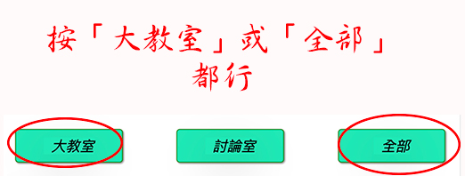

## Google Meet 分組擴充功能 by 胡浩洋

## 線上的說明書

<!-- omit in toc -->

## [詳細操作說明影片](https://youtu.be/5oGmIL3pmP4)

### 設定

- 第一步: [輸入課程](#第一步輸入課程)
- 第二步: [創建討論室](#第二步創建討論室)
- 第三步: [調整設定](#第三步調整設定)
- 第四步: [調整 Meet 變更版面配置](#第四步-調整-meet-變更版面配置)
- 第五步: [確認 Google 帳號](#第五步-確認-google-帳號)

### 快樂上課

- 第一步: [選課與指定幾個分組](#第一步選課與指定幾個分組)
- 第二步: [開課](#第二步開課)
- 步驟 3A: [分組學生-臨時](#步驟-3a-分組學生-臨時)
- 步驟 3B: [分組學生-預先](#步驟-3b-分組學生-預先)
- 第四步: [滑桿控制，入出分組與操作視聽設備](#第四步滑桿控制入出分組與操作視聽設備)
- 第五步: [廣播系統](#第五步廣播系統)
- 第六步: [靜音和移除學生](#第六步靜音和移除學生)

### 工具

- [隱藏顯示 Meet 下面的工具面板](#隱藏顯示-meet-下面的工具面板)
- [重新視窗格式](#重新視窗格式)
- [縮小放大控制面板](#縮小放大控制面板)
- [簡報](#簡報)
- [導出入數據](#導出入數據)

### 常問問題

  <!-- omit in toc -->

- [學生需要安裝這個擴充功能?](#學生需要安裝這個擴充功能)
- [我的電腦需要多大的記憶體（RAM）?](#我的電腦需要多大的記憶體-ram)
- [為什麼在分組區域無法看任何的學生?](#為什麼在分組區域無法看任何的學生)
- [為什麼無法看所有的學生?](#為什麼無法看所有的學生)
- [Co-teachers 可以使用?](#co-teachers-可以使用)
- [什麼是低記憶體(RAM)選項？](#什麼是低記憶體-RAM-選)
- [學生需要退出大教室?](#學生需要退出大教室)
- [怎麼關閉討論室](#怎麼關閉討論室)
- [怎麼使用我的擴充功能資料在兩台電腦?](#怎麼使用我的擴充功能資料在兩台電腦)

### 第一步：輸入課程

- 這件擴充功能是由課程來組織的. 第一步驟是在「課程」標籤內輸入您的課程.

  

- 需要輸入幾個課程？ 事實上，只需要輸入一個課程就可以，然後每門課再用同樣擴充功能輸入的課程。不過因為有些課之時間可能很密集，所以建議在擴充功能多輸入課程，免得兩堂課之間的學生進入退出的衝突。如果你認為比較清楚給每一門課自己的擴充功能課程名稱，就可以。看你的方便。
- 新增一行：請按綠色的「+」按鈕
- 調整課程行的順序：長按，把一行往上下拉
- 改一行文字的全部，請在文字框按三次（click 3 times)，然後這行文字全部會突出顯示。
- 儲存資料：請按藍色的按鈕。
- 課程獨特名稱：每一間討課程必須有獨特的名稱，不能重覆
- 課程刪掉：刪除一行是從行列的從最後面開始，若想把中間的行給刪掉，請拉下到最下面然後按紅色的按鈕就給最下面行刪掉
- 課程導出入是擴充功能資料的全部：導出入數據的按鈕是在最右邊黑色的按鈕。資料導出是為了個自己一個 backup，或許如果你有兩台電腦，能從第一胎電腦下載然後裝上去第二胎。**_小心_**： :eyes: 導入會完全覆盖擴充功能資料。

### 第二步：創建討論室

- 在討論時標籤內能創建討論室

  

- 新增一行：請按綠色的「+」按鈕
- 調整討論室行的順序：長按，把一行往上下拉
- 改一行文字的全部，請在文字框按三次（click 3 times)，然後這行文字全部會突出顯示。
- 儲存資料：請按藍色的按鈕。
- 討論室獨特名稱：每一間討討論室必須有獨特的名稱，不能重覆
- 討論室刪掉：刪除一行是從行列的從最後面開始，若想把中間的行給刪掉，請拉下到最下面然後按紅色的按鈕就給最下面行刪掉
- :smile: **最簡單的方法是給連結框框留著空白，不輸入任何的東西，然後儲存。** 這樣擴充功能會自動給你連結，這麼簡單.

  

- :point_right: **只有 Google Classroom 老師而已**: 如果你是 Google Classroom 老師的話，在「大教室」連結框，請輸入你的 Google Classroom “Meet Link".

  

  

- 連結的種類:

  - _暱稱（Nickname）_: 暱稱是動態的，因為每次使用 url 會創建新的連結。 暱稱是給付費 google 會員使用的，所以免費的使用者應該不會有這個功能。請注意暱稱需要獨特的名稱，免得兩位老師好一起用相同名字發生遇到同樣的 meet 連結裡面。

  - _代碼（Code）_: 代碼是連結的尾 12 字，比方說 https://meet.google.com/abc-defg-hij 的連結， 代碼是 abc-defg-hij. 這樣能輸入「abc-defg-hij」就可以。這個方法是不常用的。

  - _Meet 連結（Meet Url）_: 這是最常用的方法，留著空白就儲存，擴充功能會給你新的連結。如果你想全新的連結，就刪除留著空白儲存，擴充功能會給你新鮮的連結。

  - _普通連結（Resource Url）_: 任何的連結，比方說 youtube, 網站，等等.

### 第三步：調整設定

- 獨立視窗 / 視窗內的標籤: 挑選你想要的格式，獨立視窗或視窗的標籤。若選標籤的話，能制定在視窗頂多的標籤

  

- 顏色: 挑選 meet 的下面工具面板有什麼顏色

- 讓外人自動進入：建議不要勾選，不然持著你教書連結的外人能夠自動闖入。不過如果你不擔心這個情況，就可以勾選。由你來決定，基本上建議不優勾選。

- 美好控制板的環境：在滑桿控制背景畫面與廣播背景畫面，可以選網路上的照片，換顏色，等等。

- 自動加入 meet. 首先，擴充功能只管理自己在「教室設定」標籤內輸入的連結，擴充功能不管「教室設定」外的 meet 連結。如果擴充功能看到在電腦有一個它要管理的連結，擴充功能會幫你按「立即加入」按鈕。如果你不想要自動加入，就可以把勾選給空白，不打勾。

- 不常用的方法，建議不要勾選：如果每次上課需要新的連結，就勾選大教室或討論室。在「快樂上課」標籤，「開始上課」區域內，按開啟大教室或討論室的按鈕時，擴充功能會自動給你新增的連結，並在「教室設定」標籤內輸入創新的連結。如果勾選「討論室」比較沒問題因為開課前沒有必要通知學生討論室的連結，但勾選「大教室」比較麻煩因為要開課前需要通知學生大教室的連結，不過若勾選「大教室」要先開啟大教室才知道這個大教室的連結是什麼。建議：如果不需要這個功能，請兩個都不給勾選，留著空白。

### 第四步: 調整 Meet 變更版面配置

- 為了讓擴充功能看到你大教室所有學生，有一個 meet 設定，設定一次就可以，不用再管理它。

- 在截圖看到三個點按鈕，按一下，會有彈出菜單出現，按「變更版面配置」。

  

- 按「圖塊」，然後把「排顯示」的滑桿拉到最右邊的 49。

  

### 第五步: 確認 Google 帳號

- 確認一下，顯示的帳號是你教書的 google 帳號，如果不是，請給它按下。

  

- Google 很重視在你電腦裡你用什麼帳號第一次登入 Google，會被 Google 視為你的「主人」帳號。創新 Google Meet 連結時， Google 會把那些新的連結給你「主人」帳號管理。 如果你發現你的以前創過的連結被 Google 拒絕打開，可能是因為你創造那連結之後登出了，然後用不同帳號重新登入。

- 什麼是「主人」帳號？ 在你的電腦，**第一** 個登入 Google 的帳號就是你主人帳號。之後你就能登入好幾個帳號沒關係，但主人帳號還是你第一個登入的 Google 帳號。

- 如果發現「主人」帳號是錯，很簡單解決。按下面的藍色按鈕，需要把全部帳號給登出，然後重新登入，注意第一個登入帳號是你想要的主人帳號。我知道有一點麻煩但 chrome 瀏覽器會記得你所有帳號密碼所以會幫你重新登入。

  

### 第一步：選課與指定幾個分組

- 在「快樂上課」標籤，按「開始上課」就會出現：

  

- 在「課程」按鈕選你的課程，在幾個分組選你想要多少討論室。如果妳打開討論室後，決定要躲開討論室沒關係，就可以躲開，然後請按[重新視窗格式](#重新視窗格式) 整理好在螢幕上的試穿。

  

### 第二步：開課

- 在「開始上課」區域有三個按鈕

  

- 你可以按「大教室」打開只有大教室，或按「全部」打開大教室與討論室都有。
- 如果先按「大教室」單打開大教室，你能後來按「討論室」打開討論室。如果大教室已經開了，你按了「全部」按鈕請放心，大教室不會被打開了第二次。

- 只有 Google Classroom 老師而已:

  - 如果你先在擴充功能開啟「大教室」，再過去你的 Google Classroom 主頁開那邊的 meet 連結，你就已經是跟擴充功能同步（synced up).
  - 不過大部分 Google Classroom 老師會先在 Google Classroom 主頁開 meet 連結. 這樣的話，你再來開擴充功能的大教室就能把擴充功能與 Google Classroom meet 連結同步（synced up).
  - 小提醒 Google Classroom 老師，請把你的 Google Classroom meet 連結複，在「教室設定」大教室連結框貼上去 [創建討論室](#第二步創建討論室)

- 上課時，你能隨時多加討論室開啟，開啟後
- :warning: 除非你的電腦記憶體非常的小（像 chromebook 4GB 一樣）請不要給低記憶體（RAM）的勾選打勾。這是專門給小記憶體電腦用的，雖讓能夠開所有的視窗，但因為那種小台電腦記憶體不夠大，所以只能同時開一個視窗。
- :heart: 為了整理 meet 視窗，讓畫面比較整齊，請按「重新視窗格式」按鈕

  

### 步驟 3A： 分組學生-臨時

- 臨時分組，請按下面的按鈕:

  

- 請確認在你的大教室螢幕能夠看所有的學生，在圖塊的格式 [變更版面配置](#第四步-調整-meet-變更版面配置).

  

- 按「隨即分組」按鈕幾次才能組成你喜歡的分組。可以用 drag and drop 方式來自己調整小組，從一個小組到別的。

  

- 再來按下面的按鈕，彈出視窗會出現

  

- 在這裡按第一個按鈕，轉移到大教室的訊息窗戶貼上去，這樣會把份子討論室的連結給學生。在這裡的第二個按鈕，轉移到大教室的訊息窗戶貼上去，這樣會把小組命大給學生看，讓他們知道他們被分配到什麼小組，他們的組員是誰。

  

- 下面的截圖是大教室的訊息視窗。

  

- 在這個例子有六個小組，討論室名字是蘋果，柳橙，香蕉，芭樂，草莓，木瓜。

- 如果還沒開啟討論室的話，請記得開它們給學生使用

  

### 步驟 3B： 分組學生-預先

- 預先的說明在擴充功能寫上的，這個過程跟臨時分組是差不多，
- 差別是老師會事先自己在另外電子檔（ms word, 任何 text app) 寫下來討論分組，然後把這個檔案文字複製，轉移到大教室的 meet 的訊息視窗下面框貼上去，傳送訊息給所有的學生。

  

  

### 第四步：滑桿控制，入出分組與操作視聽設備

- 滑桿控制（slider) 會讓老師入出討論室，在滑桿控制給左右箭頭按一下，或給小黃點移動。

  

- 滑桿控制（slider) 也會讓老師操作自己的喇叭，自己的麥克風，自己的相機如下：

  - 在這個討論室:
    - 開喇叭，這樣老師能夠聽學生的討論
    - 關閉老師的麥克風所以不會打擾學生的討論。如果老師想講話，請在 slider 按麥克風。再按一次會關閉。
    - 關閉老師的相機所以不會打擾學生的討論。如果老師想開相機，請在 slider 按麥克風。再按一次會關閉。
  - 在所有其它教室:
    - 喇叭關閉.
    - 麥克風關閉
    - 相機關閉

- 建議老師都用滑桿控制 （slider) 操作視聽的按鈕。如果老師在 meet 直接按 meet 的視聽按鈕（喇叭，麥克風，相機）meet 與控制面板會造成不一致，但這個是小問題。下次老師給 slider 移動，meet 與 slider 的視聽按鈕就會行程一致。

### 第五步：廣播系統

- 廣播系統有三個按鈕：老師的喇叭，老師的麥克風，老師的相機。

  

- 退出廣播系統有兩個方法。如果你在滑桿控制移動，按左右或給小黃點移動，廣播系統會自動關閉。或許能直接在廣播按鈕按一下，關閉

### 第六步：靜音和移除學生

- 給教室靜音有很多種選擇：大教室，這個討論室，所有討論室，所有的教室
- 給教室內的學生移除有多種選擇：這個討論室，所有討論室，大教室

  

### 隱藏顯示 Meet 下面的工具面板

- 為了給自己多一點的 meet 空間，能使用這個按鈕。

- 按一次會把 meet 的最下面工具面板隱藏，再按一次會出現。

  

### 重新視窗格式

- 非常方便的按鈕會在螢幕上把所有的 meet 視窗重新整理好，看起來很整齊

  

### 縮小放大控制面板

- 按一次會縮小，再按一次會放大

  

### 簡報

- 擴充功能有一些簡單的報告，能下載 csv 格式

  

### 導出入數據

- 在「教室設定」與「課程設定」標籤內都有導出入黑色按鈕。

- **最常用的是「課程設定」標籤的**

  

- 導出入文字檔非常的小，彈出的視窗會問你要給它什麼名稱？下載是在你電腦的下載夾

- 如果是導入，輸入你的檔案名稱。

- **請注意** :eyes: 導入會在擴充功能完全覆蓋所有的資料。

  

### 學生需要安裝這個擴充功能?

- 不需要，並且不建議他們安裝，因為對學生來說沒有用，有可能讓他們困惑，所有老師們請不要求學生安裝
- 若學生不小心安裝這個擴充功能沒關係，不影響老師操作。

### 我的電腦需要多大的記憶體 RAM?

- 如果你的電腦記憶體是 16G，應該足夠大開 10 個討論室。大多數老師跟我說需要 16 Gig RAM （記憶體）, 才能順利開操作大約 10 個討論室。我有一台舊的 MacBook 具有 16G, 開過 15 個討論室就可以，但好像有一點勉強。我的 Imac 記憶體是 24G, 開啟 16 個討論室是無費吹灰之力的 :stuck_out_tongue_winking_eye:

- 如果你的電腦記憶體非常的小（像 chromebook 4GB 一樣）可以考慮看看使用低記憶體（RAM）的方式。在「快樂上課」標籤，「開始上課」區域，給第一記憶體勾選打勾。這樣能夠開超過 20 個視窗，但因為那種小台電腦記憶體不夠大，所以只能同時開一個視窗。

### 為什麼在分組區域無法看任何的學生?

- 有可能因為 meet 的變更版面配置還沒調整到圖塊，49 個學生的格式，[調整 Meet 變更版面配置](#第四步-調整-meet-變更版面配置)

- 如果你是 Google Classroom 老師的話，請確認在「教室設定」標籤的大教室連結是你的 Google Classroom 主頁上的 meet link.

### 為什麼無法看所有的學生?

- 有可能因為 meet 的變更版面配置還沒調整到圖塊，49 個學生的格式，[調整 Meet 變更版面配置](#第四步-調整-meet-變更版面配置)

### Co-teachers 可以使用?

- :tulip: 可以啊。這裡是英文版的影片說明怎麼使用
  [co-teachers](https://youtu.be/6Z_b4aWHrvY)

### 什麼是低記憶體 RAM 選?

- 此選項不常用。正常模式是不勾選此框，不打勾，off。

- 不過，如果您的電腦在打開多個分組討論室時出現明顯滯後（或當機），這可能是因為您的電腦 RAM 記憶體為 8G RAM 或更少。如果是這種情況，請考慮按“低記憶體 (RAM) 選項”，此時您一次只能看到 1 個分組討論室窗口。

- 使用此選項，您仍然可以打開和管理大量分組討論室，但為了節省使用比較低的記憶體，一次只能看一個討論室。理論上，您可以使用這種方法在一個很小的記憶體 chromebook 上管理 100 個或更多分組討論室，但是，您一次只能看到一個分組討論室，類似於 Zoom，老師一次只能看到一個分組討論室。

- 這個過程的一個不同之處在於，您需要先做一個循環，進入所有討論室（例如 20 個討論室）一間再換一間，才能讓所有學生進入他們的討論室。除非您在標籤「一般設定」勾選「讓外人自動進入教室」，否則 google meet 將要求您作為老師先在房間裡讓學生進入。但是，一旦學生進入，您就可以離開討論室並前往下一個討論室。

- 為了讓這個過程更快更順利，如果你選擇這個低記憶體選項，首先要求學生進入他們的討論室。他們會看到一條訊息說他們正在等待您進入討論室。然後您可以循環瀏覽您管理所有的討論室，在本例中為 20 個討論室，以允許他們進入。完成此循環後，一切正常。你可以進入任何你想監控他們進度的討論室。

- 值得注意：使用此選項沒有廣播功能，因為您作為老師一次只出現在一個討論室裡。

### 學生需要退出大教室?

- 不需要。我教書時後讓學生在大教室留下來。這樣學生在兩個教室同時存在，大教室與他們的討論室。如果你讓學生在大教室留下來，:eyes: 請確認在大教室所有學生靜音自己，免得大教室的聲音會打擾學生在討論室。

- 行動裝置像 iphone, ipad 這樣， 不讓學生同時開多餘的 meet, 所以在這樣的情況下，學生必要退出大教室。

### 怎麼關閉討論室?

- 一個方法是用控制面板，在「靜音移除學生」區域內，按討論室完畢的按鈕。或在討論室的 meet 直接關閉。關閉前，請記得用廣播系統通知學生要回去大教室。

### 怎麼使用我的擴充功能資料在兩台電腦?

- 在「課程設定」標籤內，按最右邊黑色按鈕導出入資料。從第一台電腦導出，在第二台電腦導入，請注意 :eyes: 導入會完全覆盖擴充功能的資料 (overwrite)
